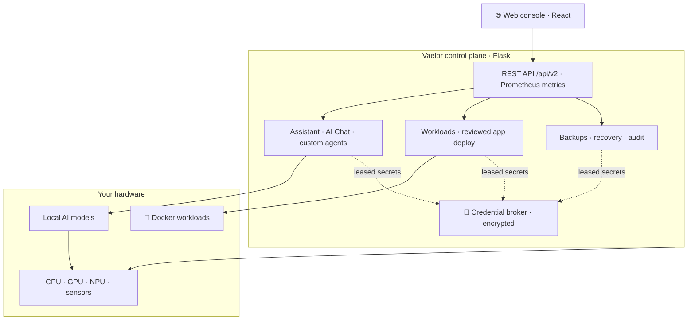

<div align="center">

# ⚡ Vaelor

### *Where intelligence, infrastructure, and command converge.*

**A local-first control plane that turns an edge computer into a managed appliance —
live hardware, on-device AI, Docker workloads, metrics, alerts, backups, and guarded
recovery, all from one clean web console.**


</div>

---

## 🧭 What is Vaelor?

Vaelor is a **self-hosted control plane for edge computers**. Point it at a small box —
a Raspberry Pi, a mini workstation — and it becomes a managed appliance you drive from a
browser: it reads the hardware, answers questions about the machine from a model running
**on the box itself**, deploys reviewed apps and local AI models, ships metrics and alerts,
takes encrypted backups, and keeps every risky action behind an explicit, audited approval.

No cloud dependency for the core. The assistant, the AI chat, the databases, and the
credential vault all run locally — what leaves the box does so only when you ask it to.

## ✨ What it does

**📊 See everything, live**
Real-time CPU / GPU / NPU / memory / storage / network / fan telemetry with a health view
that tells you *why* something is flagged — plus a Prometheus/OpenMetrics endpoint at
`/api/v2/metrics` for your own dashboards.

**🤖 On-device intelligence**
- An **operational Assistant** that answers plain-language questions about *this* machine
  ("is anything wrong?", "how hot is the GPU?") from live readings — running on a local
  NPU or GPU model, not the cloud.
- **AI Chat** with your own local or OpenAI-compatible model, plus **knowledge collections**
  (local retrieval / RAG) whose answers cite their sources.
- **Custom agents**, deny-by-default: grant one exactly the read scopes and one-shot actions
  it needs — nothing more — and every proposed change is reviewed and audited.

**📦 Run real workloads**
- One-click deploy of reviewed apps, or **describe an app in your own words** — Vaelor
  researches public docs and image metadata, verifies the digest and CPU architecture, and
  drafts a server-owned Compose file for you to approve. The model never touches your shell,
  Docker, or credentials.
- Deploy and serve **local AI models** on the box's own accelerators.

**🔔 Stay informed**
Set thresholds (CPU too hot, storage low, a service down) and get told **out of band** — by
email or webhook — the moment one fires. Guided setup: pick your email provider and Vaelor
fills in the server, port, and encryption for you.

**💾 Protect and recover**
Encrypted **scheduled + off-site backups** of the whole appliance, with retention and S3/HTTPS
targets, plus a guarded factory reset and portable-state move — every destructive action behind
a typed confirmation.

**🔐 Safe by construction**
Secrets live in an **encrypted credential broker** and are leased only to the process that needs
them — never written into jobs, logs, drafts, or API responses. Roles, per-action approvals, and
a full audit trail gate everything.

## 🏗️ How it works



It is all one source tree. Platform behaviour resolves through a driver registry and
**capability discovery** — hardware a host does not have is reported as absent, with a
reason, rather than stubbed.

## 🖥️ Tested hardware

|                | 🍓 **Raspberry Pi 5**                              | 🖥️ **HP Z2 Mini (Strix Halo)**            |
| -------------- | ------------------------------------------------- | ----------------------------------------- |
| Architecture   | ARM64                                             | x86-64                                    |
| Enclosure      | SunFounder Pironman — fans, RGB, OLED, battery HAT | none                                      |
| AI accelerator | CPU only                                          | integrated **GPU + NPU** for local models |
| Role           | the enclosure appliance                           | the AI workstation appliance              |

**How they differ:** the Pi is ARM64 with a rich physical enclosure and no AI accelerator;
the Z2 Mini is x86-64 with a GPU and NPU for on-device models but no enclosure peripherals.
Neither is special-cased — the same code adapts to whatever discovery finds. See
[SUPPORTED_PLATFORMS.md](SUPPORTED_PLATFORMS.md) and [ARCHITECTURE.md](ARCHITECTURE.md).

## 🚀 Quick start

Grab the wheel and the NPU model from the [latest release](../../releases/latest), then on
the target box:

```bash
git clone https://github.com/ShadowLayer90/vaelor.git
cd vaelor

# Install the control plane (Debian-family arm64 / amd64)
sudo deploy/install-vaelor.sh \
  --wheel /path/to/vaelor_control_plane-1.0b1-py3-none-any.whl --unattended

# Fetch + install the on-device NPU assistant model (~3.4 GB, split on the release)
deploy/fetch-npu-model.sh
```

Then open the console at `https://<host>:34001/v2/`. The installer adopts Docker if it is
already present and asks before installing it when it is not.

Build the web interface from source:

```bash
cd frontend && npm ci && npm run build
```

## 🤝 Contributing & docs

- [CONTRIBUTING.md](CONTRIBUTING.md) — how to work on Vaelor
- [ARCHITECTURE.md](ARCHITECTURE.md) — how the pieces fit
- [SECURITY.md](SECURITY.md) · [SUPPORT.md](SUPPORT.md) · [SUPPORTED_PLATFORMS.md](SUPPORTED_PLATFORMS.md)
- [CHANGELOG.md](CHANGELOG.md) — what is new

## 📄 License & upstream attribution

Vaelor is distributed under the **GNU General Public License, version 2 (GPL-2.0)** — see
[LICENSE](LICENSE).

Vaelor's Python control plane contains and extends code originating from SunFounder's
GPL-2.0-licensed Pironman projects (`pm_dashboard`, `pironman5`, `pm_auto`, `sf_rpi_status`);
their copyright notices and license files are preserved. **The web interface is not derived
from upstream** — the compiled legacy Pironman dashboard is not part of Vaelor, and the React
interface under `frontend/` is a Vaelor original. SunFounder and Pironman are names of their
respective owner; their inclusion identifies compatible hardware and upstream source and does
not imply endorsement. See [THIRD_PARTY_NOTICES.md](THIRD_PARTY_NOTICES.md) for source links
and component boundaries.

### Acknowledgements

On-device inference on the Z2 Mini's NPU is powered by
[FastFlowLM](https://github.com/ROCm/FastFlowLM). Its orchestration code and CLI are
MIT-licensed; its NPU binary kernels are proprietary and carry separate terms — Vaelor ships
none of it. Read [THIRD_PARTY_NOTICES.md](THIRD_PARTY_NOTICES.md) before redistributing
anything from that project.
