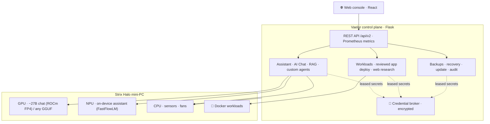

<div align="center">

# ⚡ Vaelor

### *One quiet mini-PC. Your own private AI, apps, and infrastructure — from a single console.*

**A local-first control plane that turns an AMD Strix Halo mini-workstation into a
turnkey private-AI appliance: a large chat model on the built-in GPU, an on-device
assistant on the NPU, self-hosted apps, guarded web research, document Q&A, custom
agents, live telemetry, alerts, backups, and one-click updates — all in one browser
console, all on the box, nothing forced through the cloud.**


</div>

---

## 🧭 What is Vaelor?

Vaelor is a **self-hosted control plane** that turns one small computer into a managed,
private-AI appliance you drive entirely from a browser — no terminal, no cloud account,
no Linux commands.

Its flagship target is the **HP Z2 Mini G1a** built on **AMD's Strix Halo** platform
(Ryzen AI Max — an integrated GPU *and* an XDNA neural processor sharing a large pool of
unified memory). That combination is unusual: a palm-sized, quiet, low-power box that can
hold and serve models that normally demand a discrete GPU. Vaelor is what makes it
turnkey — point the installer at the box and it becomes a private AI workstation you
manage from `https://<host>:34001/v2/`.

The assistant, the chat model, the databases, the search backend, and the credential
vault all run **on the box**. What leaves the machine leaves only when you ask it to.

## 🔪 The Strix Halo appliance — one box, many jobs

Think of it as a **Swiss Army knife for private computing**: a single Z2 Mini quietly
replaces a stack of separate subscriptions and servers.

| Instead of… | Vaelor on Strix Halo gives you… |
| --- | --- |
| A cloud chatbot subscription | **A ~27B-parameter chat model served on the built-in GPU** (AMD ROCm FP4), living in unified memory — private, and yours |
| A second "ops" tool | **An on-device assistant on the NPU** (a 4B model via FastFlowLM) that answers plain-language questions about *this* machine from live readings |
| Picking one model and living with it | **Any GGUF model you like, served on the GPU** — the recommended FP4 build is one click, but bring your own and Vaelor fits it to the hardware and explains the trade-offs |
| A VPS for self-hosted apps | **Reviewed one-click app blueprints**, or *describe an app in plain words* and Vaelor researches it, drafts a guarded Docker Compose, and deploys it |
| A separate search/scraping service | **Guarded, loopback-only web research** (a private SearXNG the models use as evidence — never given your shell, network, or credentials) |
| A document-Q&A SaaS | **Knowledge collections / RAG** over your PDFs, Word, Excel, and PowerPoint, with answers that cite their sources |
| Wiring up your own agent framework | **Custom agents**, deny-by-default — grant exactly the read scopes and one-shot actions one needs, every change reviewed and audited |
| A monitoring + alerting + backup rack | **Live CPU/GPU/NPU/memory/thermal telemetry, threshold alerts, and encrypted off-site backups** — in the same console |

All of it is **local and private by default**, gated by roles and per-action approvals,
and driven from one clean web UI. One appliance, many tools, no cloud tax.

## ✨ What it does

**🤖 On-device intelligence — GPU *and* NPU**
- **AI Chat** on a large (~27B) local model served on the Strix Halo **GPU**, or any
  OpenAI-compatible endpoint you connect. Bring your own GGUF and Vaelor picks the runtime
  and offload that fits the box.
- An **operational Assistant** on the **NPU** that answers "is anything wrong?",
  "how hot is the GPU?", "what's using memory?" from live hardware — not the cloud.
- **Knowledge collections (RAG)** over your own documents, answers citing their sources.
- **Custom agents**, deny-by-default, every proposed change reviewed and audited.

**📦 Run real workloads**
- One-click deploy of reviewed apps, or **describe an app in your own words** — Vaelor
  researches public docs and image metadata, verifies the digest and CPU architecture, and
  drafts a server-owned Compose file for you to approve. The model never touches your shell,
  Docker, or credentials.
- Serve **local AI models** on the box's own GPU/NPU accelerators.

**📊 See everything, live**
Real-time CPU / GPU / NPU / memory / storage / network / fan telemetry with a health view
that tells you *why* something is flagged — plus a Prometheus/OpenMetrics endpoint at
`/api/v2/metrics` for your own dashboards.

**🔄 Update in place**
Check for the latest release and **update from GitHub with one click** — Vaelor downloads
the release wheel, verifies its checksum, installs it, restarts, and **rolls back
automatically** if the new version fails its health check.

**🔔 Stay informed**
Set thresholds (CPU too hot, storage low, a service down) and get told **out of band** — by
email or webhook — the moment one fires. Guided setup fills in the server, port, and
encryption for you.

**💾 Protect and recover**
Encrypted **scheduled + off-site backups** of the whole appliance (retention, S3/HTTPS
targets), a guarded factory reset, a portable-state move, and an in-console **Remove Vaelor**
— every destructive action behind a typed confirmation.

**🔐 Safe by construction**
Secrets live in an **encrypted credential broker** and are leased only to the process that
needs them — never written into jobs, logs, drafts, or API responses. Roles, per-action
approvals, and a full audit trail gate everything.

## 🏗️ How it works



It is all one source tree. Platform behaviour resolves through a driver registry and
**capability discovery** — hardware a host does not have is reported as absent, with a
reason, rather than stubbed. That is how the same build runs turnkey on the Strix Halo box
and, unchanged, on a Raspberry Pi.

## 🖥️ Tested hardware

|                | 🖥️ **HP Z2 Mini G1a — Strix Halo** *(flagship)*        | 🍓 **Raspberry Pi 5**                              |
| -------------- | ------------------------------------------------------- | ------------------------------------------------- |
| Architecture   | x86-64                                                  | ARM64                                             |
| AI accelerator | integrated **GPU + NPU** — serves a ~27B GPU chat model and a 4B NPU assistant | CPU only — a compact 4B assistant |
| Unified memory | large shared pool — big models fit without a discrete GPU | standard system RAM                             |
| Enclosure      | none                                                    | SunFounder Pironman — fans, RGB, OLED, battery HAT |
| Role           | the **private-AI workstation appliance**               | the compact enclosure appliance                   |

The **Z2 Mini is the appliance Vaelor is built around**: its GPU + NPU + unified memory are
what make a genuinely private, capable AI stack fit in one small box. The **Pi 5** is fully
supported as a lighter, CPU-only appliance with a rich physical enclosure — nothing is
special-cased; the same code adapts to whatever discovery finds. See
[SUPPORTED_PLATFORMS.md](SUPPORTED_PLATFORMS.md) and [ARCHITECTURE.md](ARCHITECTURE.md).

## 🚀 Quick start

On the target box (Debian-family amd64 for the Z2 Mini, arm64 for the Pi):

```bash
# On a bare host, install git first: sudo apt install -y git
git clone https://github.com/ShadowLayer90/vaelor.git ~/vaelor

# One command. The installer downloads the release wheel itself and, on a box with a
# neural accelerator (the Strix Halo NPU), also fetches the on-device assistant model
# (~3.4 GB, split on the release):
sudo ~/vaelor/deploy/install-vaelor.sh --unattended
```

Then open the console at `https://<host>:34001/v2/`. The installer adopts Docker if it is
already present and asks before installing it when it is not. To install a specific build
instead of the release wheel, pass `--wheel /path/to/…whl`.

To skip the large model download and defer it, install with `--without-npu-model` and fetch
it later with `sudo ~/vaelor/deploy/fetch-npu-model.sh`.

Build the web interface from source: `cd frontend && npm ci && npm run build`.

## 🔄 Updating

Once installed, update from the console: **Administration → Recovery → Update Vaelor**
checks GitHub for the newest release, shows the version on offer, and — on an
administrator's approval — downloads the verified wheel, installs it, restarts, and rolls
back automatically if the new version fails its health check. You can also update at any
time by re-running the installer (`git pull` in the clone, then `install-vaelor.sh` again).

## 🤝 Contributing & docs

- [CONTRIBUTING.md](CONTRIBUTING.md) — how to work on Vaelor
- [ARCHITECTURE.md](ARCHITECTURE.md) — how the pieces fit
- [SECURITY.md](SECURITY.md) · [SUPPORT.md](SUPPORT.md) · [SUPPORTED_PLATFORMS.md](SUPPORTED_PLATFORMS.md)
- [CHANGELOG.md](CHANGELOG.md) — what is new

## 📄 License & upstream attribution

Vaelor is distributed under the **GNU General Public License, version 2 (GPL-2.0)** — see
[LICENSE](LICENSE).

Vaelor's Python control plane contains and extends code originating from SunFounder's
GPL-2.0-licensed Pironman projects (`pm_dashboard`, `pironman5`, `pm_auto`, `sf_rpi_status`);
their copyright notices and license files are preserved. **The web interface is not derived
from upstream** — the compiled legacy Pironman dashboard is not part of Vaelor, and the React
interface under `frontend/` is a Vaelor original. SunFounder and Pironman are names of their
respective owner; their inclusion identifies compatible hardware and upstream source and does
not imply endorsement. See [THIRD_PARTY_NOTICES.md](THIRD_PARTY_NOTICES.md) for source links
and component boundaries.

### Acknowledgements

On-device inference on the Strix Halo NPU is powered by
[FastFlowLM](https://github.com/ROCm/FastFlowLM). Its orchestration code and CLI are
MIT-licensed; its NPU binary kernels are proprietary and carry separate terms — Vaelor ships
none of it. GPU inference uses a ROCm-based `llama.cpp` runtime for AMD's FP4 format. Read
[THIRD_PARTY_NOTICES.md](THIRD_PARTY_NOTICES.md) before redistributing anything from those
projects.
