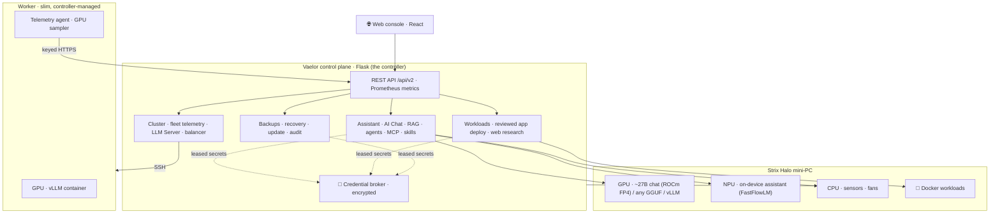

<div align="center">

# ⚡ Vaelor

### *One quiet mini-PC, or a small cluster of them. Your own private AI, apps, and infrastructure — from a single console.*

**A local-first control plane that turns an AMD Strix Halo mini-workstation into a
turnkey private-AI appliance: a large chat model on the built-in GPU, an on-device
assistant on the NPU, self-hosted apps, guarded web research, document Q&A, custom
agents, live telemetry, alerts, backups, and one-click updates — all in one browser
console, all on the box, nothing forced through the cloud. Add a second machine and
the same console serves models across both.**


</div>

---

## 🧭 What is Vaelor?

Vaelor is a **self-hosted control plane** that turns one small computer into a managed,
private-AI appliance you drive entirely from a browser — no terminal, no cloud account,
no Linux commands.

Its flagship target is the **HP Z2 Mini G1a** built on **AMD's Strix Halo** platform
(Ryzen AI Max — an integrated GPU *and* an XDNA neural processor sharing a large pool of
unified memory). That combination is unusual: a palm-sized, quiet, low-power box that can
hold and serve models that normally demand a discrete GPU. Vaelor is what makes it
turnkey — point the installer at the box and it becomes a private AI workstation you
manage from `https://<host>:34001/v2/`.

The assistant, the chat model, the databases, the search backend, and the credential
vault all run **on the box**. What leaves the machine leaves only when you ask it to —
for example when you choose to connect AI Chat to a hosted service.

## 🆕 New in 1.5

The biggest release since the first public beta. In short:

- **GPU clustering across machines.** Join a second Strix Halo machine as a worker and
  serve one model from both — one copy per machine behind a balancer for more people at
  once, or one model split across the two when it is too big for either. The worker gets
  a slim install that the controller lays down and keeps current; it runs no console of
  its own.
- **LLM Server with API keys.** Expose the model you serve as an OpenAI-compatible API on
  your LAN, with keys that are shown once, can be rotated or revoked, and are metered
  per key.
- **Agents, MCP tools, and skills for the cluster.** An administrator-curated catalog of
  MCP servers, a skills library, and deployable agents that run on the cluster's model
  with exactly the tools they were granted.
- **See the whole fleet.** Per-machine metrics and history for every machine, alert
  rules that fire on workers too, a Performance dashboard of measured values, request
  tracing to a local Arize Phoenix, and an Activity feed.
- **Load, unload, and scale to zero.** Unload a cluster model by hand or let it unload
  when idle; the next request wakes it.
- **AI Chat connects to hosted services** — OpenAI, Anthropic, Google Gemini, OpenRouter,
  or any HTTPS endpoint you add — with a **thinking control** (Off, Low, Medium, High) for
  every model that supports it. AI Chat stays free to use any model while the cluster
  serves.
- **An Assistant that knows the cluster.** The on-device Assistant answers questions
  about every machine — what it serves, its health, its history — from the telemetry
  Vaelor collects, and never sends your questions off the machine.
- **A redesigned console.** Every page was rebuilt to a new design: clearer navigation,
  a new icon set, search, and refusals shown where you made the request.

The full list, including security changes, is in [CHANGELOG.md](CHANGELOG.md).

## 🔪 The Strix Halo appliance — one box, many jobs

Think of it as a **Swiss Army knife for private computing**: a single Z2 Mini quietly
replaces a stack of separate subscriptions and servers.

| Instead of… | Vaelor on Strix Halo gives you… |
| --- | --- |
| A cloud chatbot subscription | **A ~27B-parameter chat model served on the built-in GPU** (AMD ROCm FP4), living in unified memory — private, and yours. Or connect a hosted service of your choice, clearly labelled as leaving the machine |
| A second "ops" tool | **An on-device assistant on the NPU** (a 4B model via FastFlowLM) that answers plain-language questions about *this* machine — and the machines clustered with it — from live readings |
| Picking one model and living with it | **Any GGUF model you like, served on the GPU** — the recommended FP4 build is one click, but bring your own and Vaelor fits it to the hardware and explains the trade-offs |
| A model API for your other tools | **The LLM Server** — an OpenAI-compatible endpoint on your LAN, behind keys you mint, rotate, and revoke |
| A VPS for self-hosted apps | **Reviewed one-click app blueprints**, or *describe an app in plain words* and Vaelor researches it, drafts a guarded Docker Compose, and deploys it |
| A separate search/scraping service | **Guarded, loopback-only web research** (a private SearXNG the models use as evidence — never given your shell, network, or credentials) |
| A document-Q&A SaaS | **Knowledge collections / RAG** over your PDFs, Word, Excel, and PowerPoint, with answers that cite their sources |
| Wiring up your own agent framework | **Custom agents**, deny-by-default — grant exactly the read scopes, MCP tools, and skills one needs, every change reviewed and audited |
| A monitoring + alerting + backup rack | **Live CPU/GPU/NPU/memory/thermal telemetry for every machine, threshold alerts, request tracing, and encrypted off-site backups** — in the same console |

All of it is **local and private by default**, gated by roles and per-action approvals,
and driven from one clean web UI. One appliance, many tools, no cloud tax.

## ✨ What it does

**🤖 On-device intelligence — GPU *and* NPU**
- **AI Chat** on a large (~27B) local model served on the Strix Halo **GPU**, on the
  cluster's model, on an OpenAI-compatible server on your network, or on a hosted service
  (OpenAI, Anthropic, Google Gemini, OpenRouter, or any HTTPS endpoint). Bring your own
  GGUF and Vaelor picks the runtime and offload that fits the box. A thinking control sets
  how much a reasoning model thinks before it answers.
- An **operational Assistant** on the **NPU** that answers "is anything wrong?",
  "how hot is the GPU?", "what's using memory?", "what is the worker serving?" from live
  hardware — not the cloud. It keeps its own on-device model; it is never pointed at a
  hosted service.
- **Knowledge collections (RAG)** over your own documents, answers citing their sources.
- **Custom agents**, deny-by-default, every proposed change reviewed and audited.

**🖧 Serve across machines**
- Join a second Strix Halo machine from **Cluster › Add machine**. Serving moves from
  llama.cpp to **vLLM** containers and comes back to llama.cpp when the cluster is taken
  down.
- **More people at once:** one copy of the model per machine behind a balancer; each
  conversation stays on one copy. The recommended cluster model is Qwen3-30B-A3B-Instruct
  in 4-bit weights.
- **A model bigger than one machine:** split it across machines over a dedicated link
  (such as a Thunderbolt cable), fenced so nothing else on your network can reach the
  link's ports. *Experimental in 1.5 — see [SUPPORTED_PLATFORMS.md](SUPPORTED_PLATFORMS.md).*
- **Load, Unload, and scale to zero**, usage metered per key and per deployment, and
  cluster agents with their own MCP tool grants, skills, and keys.
- Cluster apps get placement, replicas, CPU limits, label constraints, and backups of
  their data volumes.

**📦 Run real workloads**
- One-click deploy of reviewed apps, or **describe an app in your own words** — Vaelor
  researches public docs and image metadata, verifies the digest and CPU architecture, and
  drafts a server-owned Compose file for you to approve. The model never touches your shell,
  Docker, or credentials.
- Serve **local AI models** on the box's own GPU/NPU accelerators, and publish them on your
  LAN through the keyed **LLM Server**.

**📊 See everything, live**
Real-time CPU / GPU / NPU / memory / storage / network / fan telemetry for the controller
and every worker, with a health view that tells you *why* something is flagged. The
Performance dashboard shows only measured values: request health for every way in (time to
first word and writing speed), the serving engine's own metrics, on-demand profiling, and
per-request traces in a local Arize Phoenix. A Prometheus/OpenMetrics endpoint at
`/api/v2/metrics` feeds your own dashboards.

**🔄 Update in place**
Check for the latest release and **update from GitHub with one click** — Vaelor downloads
the release wheel, verifies its checksum, installs it, restarts, and **rolls back
automatically** if the new version fails its health check. Workers are brought to the
controller's software afterwards, without you touching them.

**🔔 Stay informed**
Set thresholds (CPU too hot, memory high, storage low, a service down) — and, for CPU
temperature and memory, on a single worker too — and get told **out of band** by email or
webhook the moment one fires. Guided setup fills in the server, port, and encryption for you.

**💾 Protect and recover**
Encrypted **scheduled + off-site backups** of the whole appliance (retention, S3/HTTPS
targets), backups of cluster apps' data volumes, a guarded factory reset, a portable-state
move, and an in-console **Remove Vaelor** that returns the machine to a bare OS — removing
only the packages Vaelor installed, the container images it pulled included, and leaving a
Docker or InfluxDB that was already there (`deploy/README.md` lists what each uninstall
mode removes and keeps) — every destructive action behind a typed confirmation.

**🔐 Safe by construction**
Secrets live in an **encrypted credential broker** and are leased only to the process that
needs them — never written into jobs, logs, drafts, or API responses. Roles, per-action
approvals, sign-in attempt limits, and a full audit trail written in plain words gate
everything. Hosted AI services are reached only through a pinned HTTPS transport that
refuses private addresses and redirects.

## 🏗️ How it works


```mermaid
flowchart TB
    UI["🌐 Web console · React"]
    subgraph Plane["Vaelor control plane · Flask (the controller)"]
        API["REST API /api/v2 · Prometheus metrics"]
        AI["Assistant · AI Chat · RAG · agents · MCP · skills"]
        WORK["Workloads · reviewed app deploy · web research"]
        CL["Cluster · fleet telemetry · LLM Server · balancer"]
        DATA["Backups · recovery · update · audit"]
        VAULT["🔐 Credential broker · encrypted"]
    end
    subgraph Host["Strix Halo mini-PC"]
        GPU["GPU · ~27B chat (ROCm FP4) / any GGUF / vLLM"]
        NPU["NPU · on-device assistant (FastFlowLM)"]
        SENS["CPU · sensors · fans"]
        DOCKER["🐳 Docker workloads"]
    end
    subgraph Worker["Worker · slim, controller-managed"]
        WGPU["GPU · vLLM container"]
        WTEL["Telemetry agent · GPU sampler"]
    end
    UI --> API
    API --> AI & WORK & CL & DATA
    AI --> GPU & NPU
    AI --> SENS
    WORK --> DOCKER
    CL -- SSH --> Worker
    WTEL -- keyed HTTPS --> API
    AI -. leased secrets .-> VAULT
    WORK -. leased secrets .-> VAULT
    DATA -. leased secrets .-> VAULT
    Plane --> SENS
```

It is all one source tree. Platform behaviour resolves through a driver registry and
**capability discovery** — hardware a host does not have is reported as absent, with a
reason, rather than stubbed. That is how the same build runs turnkey on the Strix Halo box
and, unchanged, on a Raspberry Pi. See [ARCHITECTURE.md](ARCHITECTURE.md).

## 🖥️ Tested hardware

|                | 🖥️ **HP Z2 Mini G1a** *(flagship)* | 💻 **HP ZBook Ultra G1a** | 🍓 **Raspberry Pi 5** |
| -------------- | ---------------------------------- | ------------------------- | --------------------- |
| Architecture   | x86-64 · Strix Halo                | x86-64 · Strix Halo (same silicon, in a laptop) | ARM64 |
| AI accelerator | integrated **GPU + NPU** — a ~27B GPU chat model and a 4B NPU assistant | the same GPU + NPU | CPU only — a compact 4B assistant |
| Unified memory | large shared pool — big models fit without a discrete GPU | the same | standard system RAM |
| Enclosure      | none                               | battery and AC reported   | SunFounder Pironman — fans, RGB, OLED, battery HAT |
| Role           | the **private-AI appliance**, and a cluster controller | a full appliance, or a **cluster worker** | the compact enclosure appliance |

The **Z2 Mini is the appliance Vaelor is built around**: its GPU + NPU + unified memory are
what make a genuinely private, capable AI stack fit in one small box. The clustering in 1.5
was built and tested on a Z2 Mini controller with a ZBook Ultra worker; the parts not yet
run live on that pair are listed in the [CHANGELOG](CHANGELOG.md). The **Pi 5** is
supported as a lighter, CPU-only appliance with a rich physical enclosure; it was not
re-tested on hardware for 1.5.

GPU model serving is offered only on the AMD Strix Halo GPU (gfx1151), the only GPU it has
been verified on. Other AMD parts, NVIDIA, and Intel hardware get discovery and telemetry
where the kernel exposes them, and serving is reported as unavailable rather than claimed.
See [SUPPORTED_PLATFORMS.md](SUPPORTED_PLATFORMS.md) for the details and the untested
platforms.

## 🚀 Quick start

On the target box (Debian-family amd64 for the Z2 Mini or ZBook, arm64 for the Pi):

```bash
# On a bare host, install git first: sudo apt install -y git
git clone https://github.com/ShadowLayer90/vaelor.git ~/vaelor

# One command. The installer downloads the release wheel itself and, on a box with a
# neural accelerator (the Strix Halo NPU), also fetches the on-device assistant model
# (~3.4 GB, split on the release):
sudo ~/vaelor/deploy/install-vaelor.sh --unattended
```

Then open the console at `https://<host>:34001/v2/`. The installer adopts Docker if it is
already present and asks before installing it when it is not.

The installer downloads from the **`v1.5`** release by default. Set `VAELOR_RELEASE_TAG`
to install from another release (for example
`sudo VAELOR_RELEASE_TAG=v1.5 ~/vaelor/deploy/install-vaelor.sh --unattended`), or pass
`--wheel /path/to/…whl` to install a specific build. `deploy/fetch-npu-model.sh` reads the
same variable.

Near the end of the run — after the console is up and healthy — the installer pre-pulls the
container images serving runs from, so the first deploy starts immediately instead of
waiting on a download. The LAN LLM Server's proxy image (about 30 MB) and the local Arize
Phoenix trace collector (about 1.5 GB) are pulled on every box that has Docker; the two AI
Chat model images are about 4.7 GB together and are pulled only on a Strix Halo–class GPU
(gfx1151/gfx1150), which is the only part they run on. The step is skipped, with the reason
printed, if the Docker data root does not have room for them. Pass `--skip-image-pull` on an
offline or air-gapped install; each image is then pulled the first time it is actually
needed, which requires registry access at that moment.

This pre-pull happens on a **fresh install** only. Updating from the console does not
pre-pull, so the first deploy after an update that changed an image reference waits on
that download instead.

To skip the large model download and defer it, install with `--without-npu-model` and fetch
it later with `sudo ~/vaelor/deploy/fetch-npu-model.sh`.

### Adding a second GPU machine

Install Vaelor on **one** machine only — that machine becomes the controller. **Do not run
the installer on the machine you want to add as a worker.** Instead, from the controller's
console open **Cluster › Add machine** and give it the worker's address and an SSH login
that can use `sudo`. The controller installs what the worker needs — Docker, the telemetry
agent, a GPU sampler, and AMD's `amd-smi` — and keeps it at its own version from then on.
Serving a model on the cluster downloads the vLLM image (about 27 GB) on each machine at
that moment, not at install time.

The installer refuses to run on a machine that is a cluster worker. If a worker's
controller is gone for good, `install-vaelor.sh --leave-worker-role` (the installer prints
the exact confirmation phrase it needs) takes the worker software off before installing the
full appliance. The requirements — registry access, the cluster link, and ports — are in
[SUPPORTED_PLATFORMS.md](SUPPORTED_PLATFORMS.md#clustering-prerequisites).

Build the web interface from source: `cd frontend && npm ci && npm run build`.

## 🔄 Updating

Once installed, update from the console: **System › Hardware and services › Update Vaelor**
checks GitHub for the newest release, shows the version on offer, and — on an
administrator's approval — downloads the verified wheel, installs it, restarts, and rolls
back automatically if the new version fails its health check. On a cluster, the controller
then brings each worker's software to the new version within about fifteen minutes; you do
not update workers yourself. You can also update the controller at any time by re-running
the installer (`git pull` in the clone, then `install-vaelor.sh` again).

## 🤝 Contributing & docs

- [CONTRIBUTING.md](CONTRIBUTING.md) — how to work on Vaelor
- [ARCHITECTURE.md](ARCHITECTURE.md) — how the pieces fit
- [SECURITY.md](SECURITY.md) · [SUPPORT.md](SUPPORT.md) · [SUPPORTED_PLATFORMS.md](SUPPORTED_PLATFORMS.md)
- [CHANGELOG.md](CHANGELOG.md) — what is new

## 📄 License & upstream attribution

Vaelor is distributed under the **GNU General Public License, version 2 (GPL-2.0)** — see
[LICENSE](LICENSE).

Vaelor's Python control plane contains and extends code originating from SunFounder's
GPL-2.0-licensed Pironman projects (`pm_dashboard`, `pironman5`, `pm_auto`, `sf_rpi_status`);
their copyright notices and license files are preserved. **The web interface is not derived
from upstream** — the compiled legacy Pironman dashboard is not part of Vaelor, and the React
interface under `frontend/` is a Vaelor original. SunFounder and Pironman are names of their
respective owner; their inclusion identifies compatible hardware and upstream source and does
not imply endorsement. See [THIRD_PARTY_NOTICES.md](THIRD_PARTY_NOTICES.md) for source links
and component boundaries.

### Acknowledgements

Powered by [FastFlowLM](https://github.com/ROCm/FastFlowLM): on-device inference on the
Strix Halo NPU runs on it. Its orchestration code and CLI are MIT-licensed; its NPU binary
kernels are proprietary and carry separate terms — Vaelor ships none of it, and the
installer downloads the pinned upstream release. Single-machine GPU inference uses ROCm
builds of `llama.cpp`, including one for AMD's FP4 format; serving across machines uses
[vLLM](https://github.com/vllm-project/vllm). Read
[THIRD_PARTY_NOTICES.md](THIRD_PARTY_NOTICES.md) before redistributing anything from those
projects.
